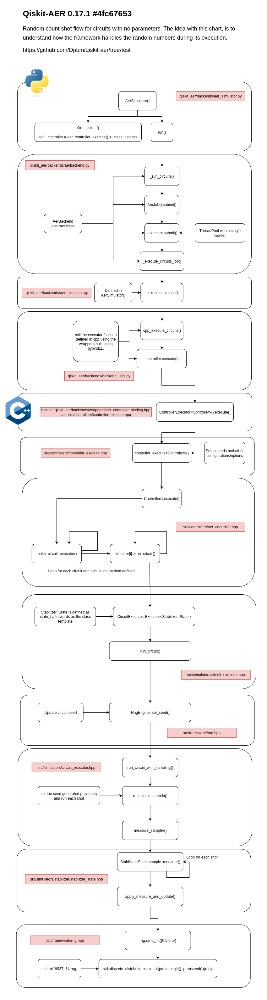
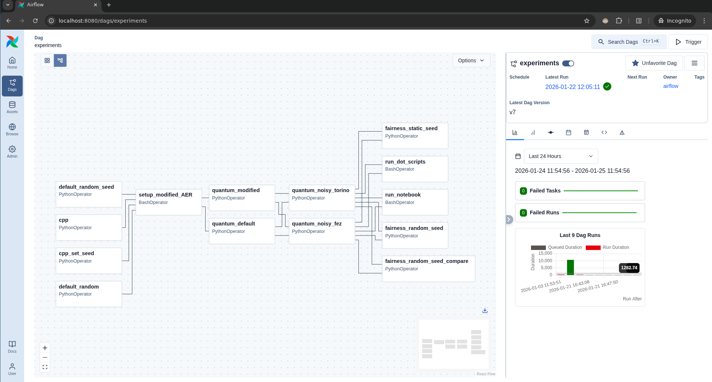

# A Study of Fairness in Buckshot Roulette Using Classical and Quantum Simulations

In this repo, we store all the code, results and analysis from our study on random engines fairness.

Here, we simulated the Buckshot Roulette dynamics in both quantum and classical domains.

Our primary goal was to identify which version could lead to a better player payoff. But at the end, our results raised the fairness discussing, since we found some bias in the classical version.

## Experiments

### Classical

Our classical simulation, was done using python with its built-in random module and a cpp version we built based on the Qiskit-AER flow as shown below:



At first, we found the classical results very different from what quantum had produced, so we studied the internals of Qiskit AER to extract its random engine and employ it on our study.

### Quantum

For quantum, we used the default AER ideal simulator, a modified version of AER that we tailored to rotate seeds in every call and two noise enabled simulations using `Fez` and `Torino` locally.

If you want to check our modified version, you can find it here: [https://github.com/Dpbm/qiskit-aer/tree/new-version](https://github.com/Dpbm/qiskit-aer/tree/new-version).

The circuit we did, use the `Qiskit` dynamic circuits capabilities to allow us to orchestrate the quantum plays and rounds as the game goes on.


### Overall

In total, we ran $8$ experiments being them:

* python random with fixed seed
* python random with random seed
* python+cpp engine with fixed seed
* python+cpp engine with random seed
* quantum ideal (fixed seed)
* quantum with modified aer for random seeds
* quantum noisy experiment with `IBM Fez`
* quantum noisy experiment with `IBM Torino`

Each of these ran for $4$ different strategies, being them:

* probability based (check if the probability of being a live shell is $> 50\%$)
* always shoot the opponent
* randomly shoot a player, could be itself or its opponent ($50/50$ strategy)
* always shoot itself

And for statistical gathering, we run $1000$ samples for $1000$ shots each, so each version had: $4 * 1000 * 1000 = 4000000$ results resulting in $32000000$ data points.

### How to run?

All the code was done in `python` with a bit of `jupyter`, `bash` and `graphviz dot language`. 

To automate and make it all easier to maintain, we developed an `Apache Airflow` pipeline.

To run that, we recommend you using `uv` for managing your python environment and `make` to allow you build and setup things easily. Then, running:

```bash
make # to build our cpp random engine
make airflow-up # to start the airflow setup
```

you'll have an `Airflow` instance at `localhost:8080`.


